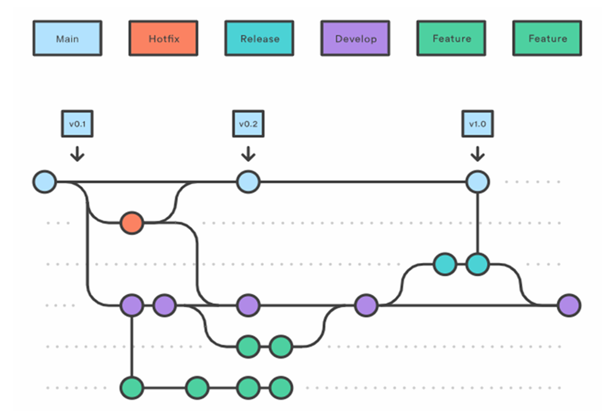

## Proyecto Final - Ingeniería de Sofware II 
# Estrategias de Ramificación - Modelo GitFlow

### **Integrantes del Grupo:**
* **Cano Arce**, Valentina
* **Cano**, Juan
* **Gonzalez**, Santiago
* **Lobo**, Sergio

---


## 1. Introducción a SCM

La Gestión de la Configuración de Software (SCM) es una disciplina transversal en la ingeniería de software que administra la evolución de productos complejos. Debido a que el software es un activo intangible y en constante cambio, la SCM actúa como el marco que organiza y controla cada modificación. Su importancia fundamental reside en que permite la colaboración de múltiples integrantes sin comprometer la integridad del sistema, asegurando que siempre exista una línea base (baseline) estable y recuperable ante cualquier error en el desarrollo.

En el contexto actual, donde los ciclos de entrega son cada vez más cortos, el uso de Sistemas de Control de Versiones (VCS) como Git se ha consolidado como el estándar de la industria para gestionar esta mutabilidad. Para organizar el trabajo en equipo, referentes del área como Vincent Driessen han formalizado modelos de ramificación (branching) profesionales. En este trabajo, aplicamos específicamente el modelo **GitFlow**, el cual permite gestionar la complejidad del desarrollo paralelo y los lanzamientos de versiones mediante una estructura de ramas que asegura la trazabilidad total del proyecto.


---

## 2. Desarrollo práctico

En esta sección se describe la metodología aplicada para la construcción colaborativa de este informe, utilizando Git como tecnología de control de versiones distribuido. El objetivo es proporcionar una guía reproducible del flujo de trabajo GitFlow.

  ###  2.1 Marco Teórico y Conceptos Fundamentales 
 Para comprender la implementación práctica, es necesario definir los pilares de la Gestión de la Configuración de Software (SCM) aplicados en este proyecto.

  #### 2.1.1 ¿Qué es GitFlow?
 GitFlow es un modelo de ramificación (branching model) diseñado por Vincent Driessen que proporciona una estructura robusta para la gestión de proyectos a gran escala. A diferencia de otros flujos más simples, GitFlow asigna roles muy específicos a diferentes ramas, definiendo con precisión cuándo y cómo deben interactuar entre sí.

 Este modelo es ideal para proyectos que requieren un ciclo de lanzamiento organizado, ya que separa el trabajo en curso de la versión estable y probada.

 #### 2.1.2 Componentes del Modelo (Ramas)
En GitFlow, las ramas se dividen en dos categorías principales:

 - **Ramas Permanentes:**

   - **Main (o Master)**: Es la línea base de producción. Todo el código aquí es "sagrado", está probado y listo para el usuario final.

   - **Develop**: Es la rama de integración. Aquí es donde se reúnen todas las funcionalidades terminadas antes de pasar a producción.

- **Ramas de Apoyo (Transitorias):**

   - **Feature Branches:** Ramas temporales donde se desarrolla cada funcionalidad o sección del informe. Nacen de develop y vuelven a develop.

   - **Release Branches:** Se utilizan para preparar una nueva versión oficial (limpieza de errores, tildes, formato).

   - **Hotfix Branches:** Ramas de emergencia que nacen de main para corregir errores críticos sin interrumpir el trabajo en develop.

   


*Este diagrama técnico detalla la arquitectura del modelo GitFlow, visualizando la jerarquía y el flujo de trabajo entre las ramas permanentes y las transitorias. En la imagen se observa cómo la rama Main actúa como la línea base de producción estable, mientras que la rama Develop centraliza la integración de las funcionalidades desarrolladas en las ramas Feature. Además, el esquema ilustra el uso de ramas de Release para la preparación de lanzamientos y ramas de Hotfix para correcciones de emergencia, garantizando que el desarrollo paralelo no comprometa la integridad del sistema*

#### 2.1.3 Conceptos de Control de Versiones
- **Repositorio Distribuido:** A diferencia de los sistemas centralizados, cada integrante posee una copia completa del historial (gracias a Git), lo que permite trabajar sin conexión y con mayor seguridad.

- **Trazabilidad:** Es la capacidad de rastrear cada cambio hasta su origen (quién lo hizo, cuándo y por qué). En este informe, esto se evidencia en el historial de commits.

- **Integridad del Sistema:** Asegurada mediante el uso de Pull Requests, donde el contenido es supervisado antes de ser fusionado a la línea base.


### 2.2 Dinámica de Trabajo en GitFlow
A diferencia de otros modelos, GitFlow se basa en el uso de ramas con ciclos de vida definidos. Los desarrolladores trabajan en ramas de función aisladas y solo fusionan su código cuando la funcionalidad está completa y verificada. Esto garantiza que la rama principal siempre contenga código estable.

 #### Flujo General de Trabajo:
1. Se inicializa una rama develop desde main.
2. Se desprenden ramas feature desde develop para cada nueva tarea.
3. Al finalizar una feature, esta se fusiona nuevamente en develop.
4. Se crea una rama release desde develop para preparar el lanzamiento.
5. La release se fusiona en main (producción) y en develop.
6. Ante errores críticos en main, se utilizan ramas hotfix para reparaciones rápidas.


### 2.3 Implementación Práctica del Flujo de Trabajo

En esta sección se describe la ejecución técnica de la metodología GitFlow aplicada a la construcción de este informe.


 #### 2.3.1 Configuración de la Línea Base (Baselines)
Antes de comenzar, es imperativo establecer las ramas de vida larga. En SCM, esto garantiza que la rama de producción (main) sea inmutable mientras se trabaja en la rama de integración (develop).

```bash
 # Crear e inicializar la rama de desarrollo
git checkout -b develop main
git push origin develop # Sube la rama al servidor
```

A partir de este punto, el repositorio cuenta con dos ramas de vida larga:
- `main`: rama estable de referencia (vacia/inicial).
- `develop`: rama de integración donde se unifican los aportes del equipo.


#### 2.3.2 Ciclo de Vida de una Funcionalidad (Feature Branches)
Para cumplir con el desarrollo colaborativo, cada integrante trabajó en una rama aislada de tipo feature. Tomaremos como ejemplo la creación de la sección de "Introducción" a cargo de Valentina.


**Preparación**: Antes de crear una nueva rama de funcionalidad, es necesario situarse sobre la rama develop, ya que según el modelo GitFlow, todas las ramas feature deben originarse desde allí. Para corroborar en qué rama estamos posicionados, ejecutamos:

```bash
git branch
``` 

1. **Sincronizar el repositorio local**: Antes de comenzar, es fundamental partir de la versión más reciente de la rama de integración para evitar conflictos de mezcla (merge conflicts) a futuro
```bash
git checkout develop
git pull origin develop
```

2. **Crear una rama de funcionalidad aislada:** Se crea una rama transitoria para no afectar la estabilidad de develop mientras se edita el contenido.
```bash
# El modificador -b crea la rama y nos posiciona en ella automáticamente
git checkout -b feature/introduccion develop
```

3. **Registrar avances mediante commits atómicos:** Se guardan los cambios de forma incremental con mensajes descriptivos.
```bash
git add README.md git commit -m "Valentina: Redacción de la base teórica de SCM"
```

4. **Publicar la rama para revisión:** Se sube la rama al servidor remoto para que esté disponible en GitHub.
```bash
git push origin feature/introduccion
```


5. **Solicitud de Integración (Pull Request)** A través de la interfaz de GitHub, se solicita la unión de feature/introduccion hacia develop. En este punto, el Supervisor  realiza la revisión del contenido.

6. **Aceptación y Limpieza (Merge & Delete)** Una vez aprobado el cambio, se realiza el merge en la plataforma. Para mantener la higiene del repositorio, se procede a borrar la rama que ya no es necesaria:

```bash
# Volver a develop y descargar el trabajo ya integrado
git checkout develop
git pull origin develop

# Borrar la rama localmente
git branch -d feature/introduccion

# Borrar la rama en el servidor remoto
git push origin --delete feature/introduccion
```

#### 2.3.3 Preparación de la Entrega (Release Branch)

Una vez que las funcionalidades de los creadores de contenido fueron integradas en develop, el supervisor procedió a la fase de estabilización. En esta etapa no se agrega contenido nuevo; solo se realizan ajustes de formato, correcciones ortográficas y validación de enlaces.

 **Finalizacion del producto**: 
 ```bash
 # 1. Crear rama de lanzamiento para pulir el documento
git checkout -b release/v1.0 develop

# 2. Integrar en producción (main) tras la revisión final
git checkout main
git merge release/v1.0

# 3. Importante: Integrar los ajustes de vuelta a develop 
# para que la rama de desarrollo también esté actualizada
git checkout develop
git merge release/v1.0

# 4. Etiquetado de versión oficial
git checkout main
git tag -a v1.0 -m "Entrega Final - Ingeniería de Software II"

```

#### 2.3.4 Gestión de Emergencias (Hotfix Branch)
En caso de detectar un error crítico en la versión ya entregada (ej. un link roto o error en la carátula que afecte la legibilidad), se utiliza una rama de corrección rápida para evitar esperar al próximo ciclo de desarrollo.

 ```bash
# 1. Crear hotfix directamente desde la rama de producción
git checkout -b hotfix/error-caratula main

# 2. (Se corrige el error en el archivo y se realiza el commit)
git add README.md
git commit -m "Sergio: Corrección de error crítico en carátula"

# 3. Finalizar hotfix: fusionar en main y en develop
git checkout main
git merge hotfix/error-caratula
git checkout develop
git merge hotfix/error-caratula

# 4. Eliminar rama de emergencia
git branch -d hotfix/error-caratula
 ```


### 2.4 Mejores prácticas y recomendaciones 

Para asegurar un desarrollo de alta calidad y mantener la integridad del proyecto, el equipo aplicó las siguientes recomendaciones de la disciplina SCM:

- **Principio de Menor Privilegio en Ramas:** Está estrictamente prohibido realizar commits directos en las ramas main y develop. Todo cambio debe nacer en una rama de apoyo y pasar por un proceso de revisión.

- **Commits Atómicos:** Se realizaron registros pequeños y frecuentes. Esto facilita la identificación de errores y permite revertir cambios específicos sin afectar el resto del trabajo.

- **Higiene del Repositorio:** Una vez que una feature es fusionada, la rama se elimina tanto local como remotamente para evitar la "deuda técnica" visual en el grafo del proyecto.

- **Uso de Pull Requests (PR):** La integración siempre debe ser solicitada mediante un PR. Esto fomenta la Revisión por Pares (Peer Review), mejorando la calidad técnica y asegurando que al menos dos integrantes conozcan cada cambio realizado.

- **Sincronización Continua:** La ejecución constante de git pull antes de iniciar cualquier tarea garantiza que el desarrollador trabaje siempre sobre la última línea base común.

---
# 3. Análisis Comparativo: GitFlow vs. GitHub Flow (Trunk-Based)

Para la fundamentación de este proyecto, hemos contrastado el modelo seleccionado (**GitFlow**) con la estrategia moderna de **GitHub Flow**, la cual es una implementación práctica de la metodología conocida teóricamente como *Trunk-Based Development* (TBD). [cite_start]Basándonos en la bibliografía analizada[cite: 168], presentamos las diferencias clave y la justificación de nuestra elección.